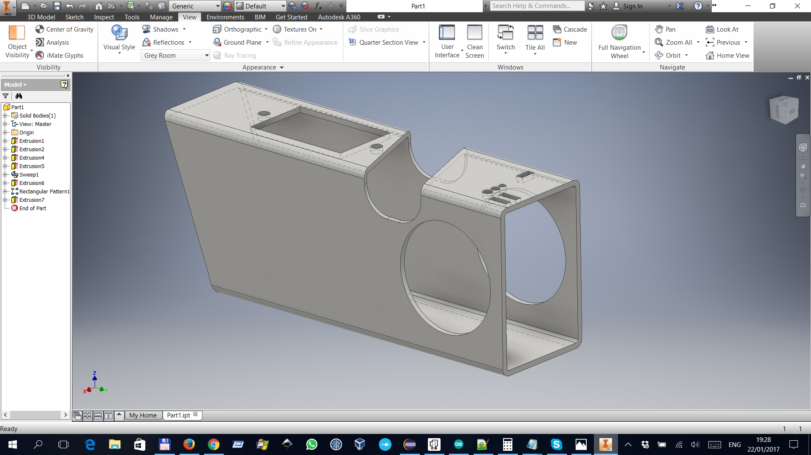

# PipeCutter
[](https://travis-ci.org/zhivko/PipeCutter)

Plasma 4 axis pipe cutter with BBB, CRAMPS and machinekit integration. Source code in JAVA.

Used to generate GCODE of Autodesk Inventor pipe like this:
<br>

<br>

<br>
And runs that gcode on [BeagleBone Black](https://beagleboard.org/black).
<br>

<br>
You can check my Google "Machinekit PipeCutter" album to better get idea of project:
<br>
[G+ Album](https://goo.gl/photos/4A623DBE1DQRwYfcA)
<br>
<br>

**Functionalities**
<br>
Produce GCODE
<br>
Stepping through GCODE reading motion.program-line hal pin
<br>

<br>


**Steps to start SW**
You would need:
<br>
OpenJDK Runtime Environment (build 1.8.0_45-internal-b14)
<br>
and
<br>
Apache Maven 3.3.3
<br>

1. clone this GIT repository
<br>
`git clone https://github.com/zhivko/PipeCutter`
<br>
2. build self contained jar with running this command in cloned repo:
<br>
`mvn package`
<br>
3. start SUrfaceDemo with with:
<br>
`java -jar ./target/SurfaceDemo-standalone-jar-with-dependencies.jar`
<br>


**Linux notes**
<br>
**Backing up BBB**
<br>
http://elinux.org/BeagleBone_Black_Extracting_eMMC_contents
<br>
**BBB becomes unresponsive**
<br>
http://dave.cheney.net/2013/09/22/two-point-five-ways-to-access-the-serial-console-on-your-beaglebone-black
<br>
***AVAHI Daemon doesn't always bring up beaglebone.local***
<br>
```
sudo systemctl --system daemon-reload'
sudo systemctl start avahi-daemon.service
sudo systemctl status avahi-daemon.service
```

**machinekit hal remote components**
<br>
https://github.com/mhaberler/asciidoc-sandbox/wiki/Remote-HAL-Components
<br>
***Linux CNC notes***
<br>
halcmd
show pin motion.spindle-*
(
  while true
  do
    halcmd show pin *.f-error >> ~/f-error.log
    usleep 50
  done
) &
disown


